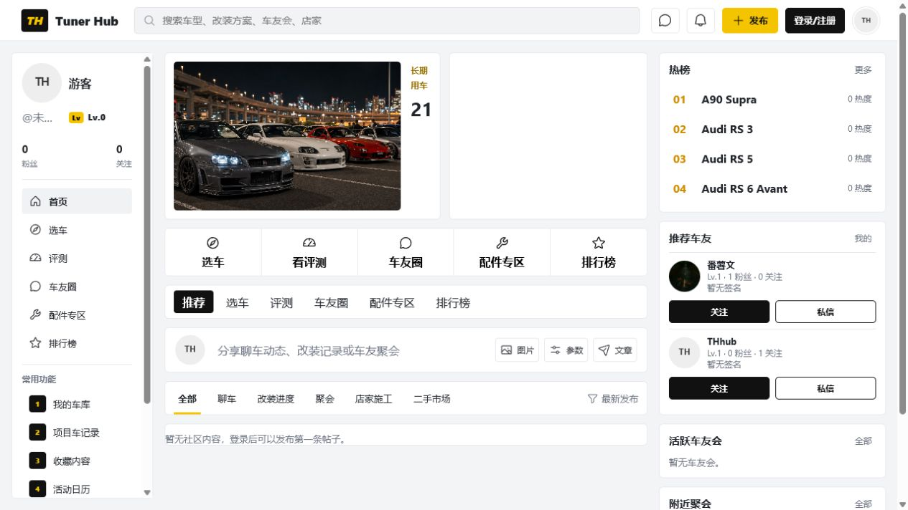
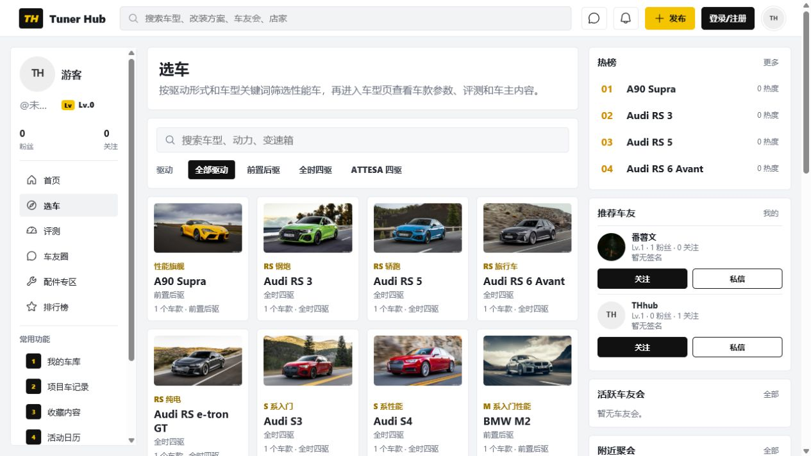
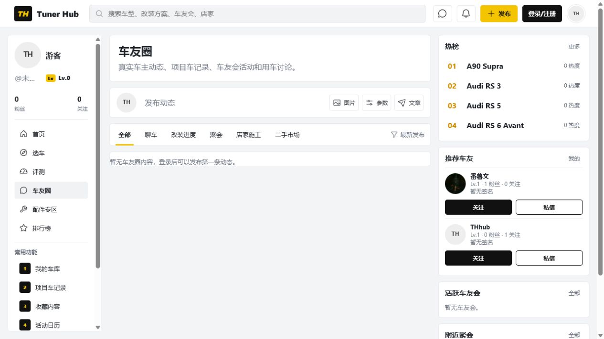

# Tuner Hub 用户体验检查报告

检查日期：2026-07-18  
检查环境：线上站点 `http://8.210.35.92/`，桌面端未登录状态  
线上真实数据：1 篇文章、0 条动态、17 个车型、2 个用户、0 个车友会、0 场活动、0 条配件内容。

## 检查结论

网站的基础导航、车型库、文章阅读和账号入口已经形成完整框架，车型库是目前完成度最高的页面。现在最影响用户感受的不是配色，而是数据较少时仍展示大量空模块，让首页、车友圈、评测和配件专区显得像没有加载完成。

## 检查步骤

1. 首页：需要尽快调整。首篇文章可以正常进入，但只有一篇文章时，头部右半部分是大块空白；社区和右栏又连续出现多个“暂无内容”。
2. 车型库：整体良好。搜索、驱动筛选、车型图片和车型入口清楚，但右栏内容与选车任务关系不大，挤占浏览空间。
3. 车友圈：功能入口清楚，但内容为空。发布入口存在，空状态缺少更明确的引导和推荐车型圈。
4. 文章详情：阅读宽度和文字层级基本合适。摘要重复问题已修复，作者信息已移到标题上方，评论区本次已与正文对齐。
5. 评测、配件专区和排行榜：页面可以访问，但真实数据不足时主要显示空状态或全部为 0 的榜单，用户会怀疑功能尚未完成。
6. 登录、注册和找回密码：主要入口完整。注册缺少用户协议和隐私政策确认，弹窗也缺少更明确的无障碍标识。
7. 个人中心、车库和项目记录：代码中的添加和设置入口完整；本次未使用真实账号提交数据，未执行会改变线上数据的操作。

## 优先处理

### 1. 首页头部空白像加载失败

只有一篇文章时，左侧显示文章，右侧新闻列表仍保留完整空白区域，而且没有空状态文字。建议在文章不足两篇时让主文章占满整行，或将右侧改为“最新车型/新用户引导”。

### 2. 空栏目过多，削弱真实社区感

车友圈、车友会、聚会、配件、评测均缺少真实内容。坚持真实数据是对的，但空模块不应全部同时展示。建议隐藏没有数据的右栏模块，并在主区域保留一个明确动作，例如“发布第一条动态”或“进入车型车友圈”。

### 3. 热榜全部为 0 仍显示排名

当前 A90 Supra、Audi RS 3 等车型全部是 0 热度，却被标为热榜前四。用户会认为榜单是假的。没有有效互动数据时建议显示“车型库新收录”，不要显示排名和热度。

### 4. 管理员删除按钮过于突出

“删除文章”紧贴文章标题且没有二次确认。普通用户看不到，但管理员阅读时容易误触，也打断文章层级。建议移入右上角“文章管理”菜单，并在删除前确认。

### 5. 游客等级显示重复

左侧显示为 `Lv Lv.0`，属于直接可见的文案错误。建议统一显示 `Lv.0`；游客状态也可以直接显示“登录后查看等级”。

## 后续优化

- 顶部、左侧、中部快捷入口和频道栏多次重复“选车、评测、车友圈、配件专区、排行榜”，首页信息层级偏拥挤。
- 右侧栏在车型库等任务页面仍固定展示推荐车友、车友会和聚会，建议根据页面切换成相关车型、热门文章或最近浏览。
- 当前唯一文章属于“长期用车”，但评测页只收录评测、导购和视频，因此评测页仍是空的。建议改名为“文章”或纳入长期用车、改装案例。
- 顶部搜索只有回车触发，放大镜看起来可点击但实际不是按钮。建议增加可点击的搜索按钮。
- 使用 `role="button"` 的文章和车型卡片只有鼠标点击逻辑，键盘按 Enter 不一定能打开；弹窗缺少 `role="dialog"`、焦点锁定和明确的关闭按钮说明。
- 公开网站尚未看到用户协议、隐私政策、内容规范、举报入口和站点备案/联系信息，会影响注册信任和正式上线合规性。
- 文章下方“详细信息”和空的推荐动态对阅读帮助有限，内容不足时建议隐藏，避免文章结束后继续堆叠空模块。

## 本次已完成

文章评论区宽度从 920px 调整为 820px，与正文内容线一致；评论输入框仍保持大尺寸，手机端仍自适应占满可用宽度。

## 证据

## 检查限制

本次没有使用真实用户账号发布、删除、关注、私信或修改资料，避免改变线上数据；邮件到达率、封禁流程和不同权限账号仍需单独做登录态验收。桌面端已做视觉检查，移动端风险主要根据现有响应式代码判断，尚未形成完整的真机截图组。
